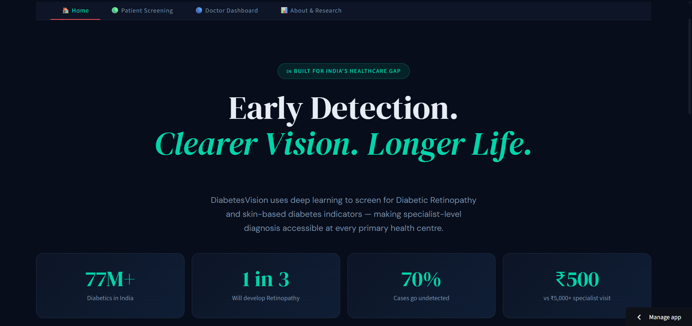
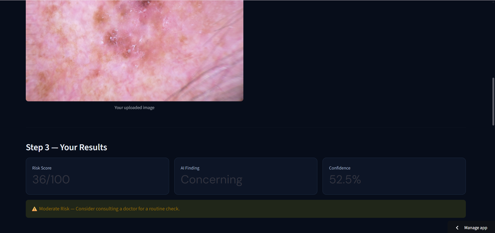
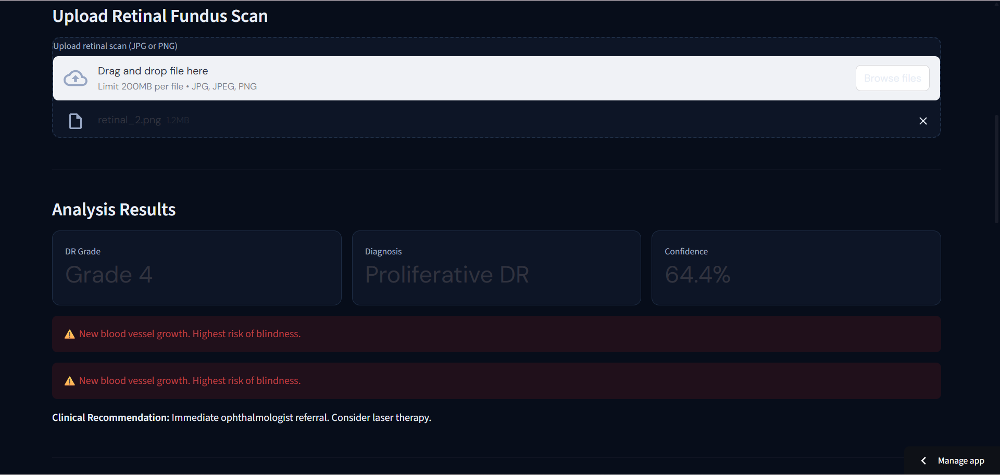
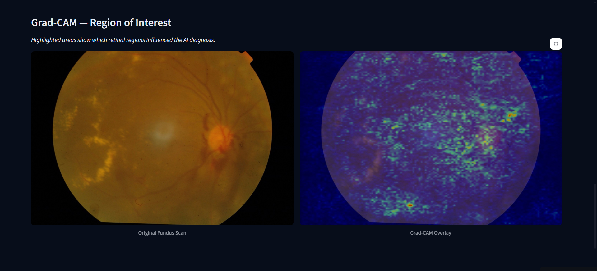

# 🩺 DiabetesVision — AI-Powered Diabetes Screening


> **Early Detection. Clearer Vision. Longer Life.**

DiabetesVision is a dual-mode AI screening tool that detects signs of diabetes from medical imaging — making specialist-level diagnosis accessible at every primary health centre in India.

🔗 **Live App:** [diabetesvision.streamlit.app](https://diabetesvision-gkdgxrf9c9fkdijqffbedu.streamlit.app)

---

## 📸 Screenshots

### Home — Problem & Solution


### Patient Screening — Skin Lesion Risk Assessment


### Doctor Dashboard — Retinal DR Grading


### Grad-CAM — Explainability


---

## 🧠 The Problem

India has **77 million diabetics** — the second highest in the world. Diabetic Retinopathy (DR) is the leading cause of preventable blindness, affecting 1 in 3 diabetic patients. Yet:

- **70% of cases go undetected** due to lack of specialist access in rural areas
- India has only **1 ophthalmologist per 70,000 people** in Tier 2/3 cities
- A specialist retinal screening costs **₹3,000–₹8,000** — unaffordable for most

DiabetesVision addresses this gap by deploying AI-powered screening at the point of care — no specialist required.

---

## ✅ Solution

Two deep learning models working in parallel:

| Mode | Input | Model | Output |
|------|-------|-------|--------|
| 🟢 Patient Screening | Skin lesion photo | MobileNetV2 | Risk score (0–100) + Grad-CAM |
| 🔵 Doctor Dashboard | Retinal fundus scan | MobileNetV2 | DR Grade (0–4) + Clinical recommendations |

---

## 🏗️ Model Architecture

### Model 1 — Skin Lesion Classifier
- **Architecture:** MobileNetV2 (Transfer Learning + Fine-tuning)
- **Dataset:** HAM10000 — 10,015 dermoscopy images
- **Classes:** Concerning (melanoma, BCC, AKIEC) / Not Concerning
- **Accuracy:** 85.07% validation accuracy
- **Input Size:** 128 × 128 × 3
- **Training:** Phase 1 (frozen base, 10 epochs) + Phase 2 (fine-tune last 30 layers, 20 epochs)

### Model 2 — Retinal DR Grader
- **Architecture:** MobileNetV2 (Transfer Learning + Fine-tuning)
- **Dataset:** APTOS 2019 — 2,930 retinal fundus images
- **Classes:** DR Grade 0 (No DR) → Grade 4 (Proliferative DR)
- **Accuracy:** 70.6% validation accuracy
- **Input Size:** 128 × 128 × 3
- **Preprocessing:** CLAHE contrast enhancement

---

## 🔥 Explainability — Grad-CAM

Every prediction includes a **Grad-CAM heatmap** showing which regions of the image influenced the AI's decision. This is critical for clinical adoption — doctors can verify the AI's reasoning rather than trusting a black-box result.

Grad-CAM computes the gradient of the predicted class score with respect to the input image, producing a heatmap where:
- 🔴 **Red/Yellow** = High influence regions
- 🔵 **Blue** = Low influence regions

---

## 💼 Business Case

| Metric | Value |
|--------|-------|
| Cost per AI screening | ₹200–500 |
| Cost per specialist visit | ₹3,000–8,000 |
| Screening speed | Seconds vs 30+ minutes |
| Target market | 18M+ underserved diabetic patients in rural India |

**Target users:**
- 🏥 Primary Health Centres (PHCs) — rural DR screening without specialists
- 🏨 Private Clinics — AI-assisted diagnosis for dermatologists and GPs
- 🧑‍⚕️ Patients — self-screening between doctor visits

---

## 🚀 Run Locally

```bash
# Clone the repo
git clone https://github.com/065010-AmanMalhi/diabetesvision.git
cd diabetesvision

# Create virtual environment
python -m venv venv
venv\Scripts\activate  # Windows
source venv/bin/activate  # Mac/Linux

# Install dependencies
pip install -r requirements.txt

# Run the app
python -m streamlit run app.py
```

> **Note:** Models are auto-downloaded from Google Drive on first run. Ensure you have an active internet connection.

---

## 📁 Project Structure

```
diabetesvision/
├── app.py                  # Main entry point — tab navigation
├── pages/
│   ├── home.py             # Landing page — problem/solution story
│   ├── patient_mode.py     # Skin lesion screening
│   ├── doctor_mode.py      # Retinal DR grading dashboard
│   └── about.py            # Research & methodology
├── models/                 # Auto-downloaded on first run
│   ├── skin_model_best.h5
│   └── retinal_model_full.h5
├── requirements.txt
└── README.md
```

---

## 📂 Datasets

| Dataset | Source | Size |
|---------|--------|------|
| HAM10000 | [Kaggle](https://www.kaggle.com/datasets/kmader/skin-lesion-analysis-toward-melanoma-detection) | 10,015 images |
| APTOS 2019 | [Kaggle](https://www.kaggle.com/competitions/aptos2019-blindness-detection) | 3,662 images |

---

## 🛠️ Tech Stack

- **Model Training:** TensorFlow / Keras, Google Colab (T4 GPU)
- **Explainability:** Grad-CAM (input gradient saliency)
- **Frontend:** Streamlit, Plotly
- **Image Processing:** OpenCV, PIL
- **Deployment:** Streamlit Cloud

---

## ⚠️ Disclaimer

DiabetesVision is a screening tool intended to assist — not replace — medical professionals. All results should be reviewed by a qualified healthcare provider. This tool is not FDA/CE approved for clinical diagnosis.

---

## 👨‍💻 Author

**Aman Malhi**  
Built as part of a deep learning project series covering CNN architecture.
